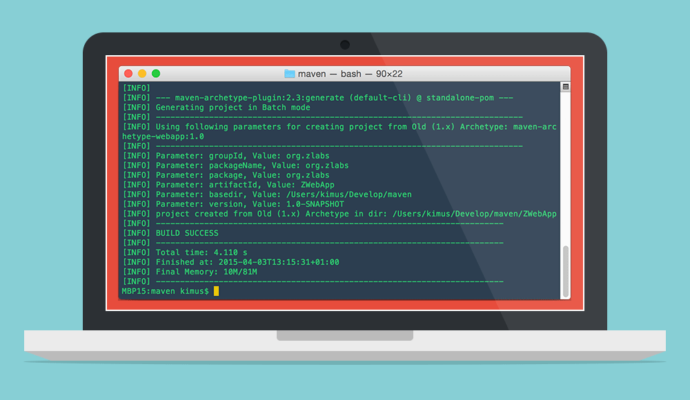

layout: post
title: "Building a WebApp with Grunt"
date: 2015-05-03 20:24:21
tags:
- node
- grunt
---

I use Grunt for everything I can these days. It’s really great. If you do front-end work, but haven’t tried it before, please stop now and go check it out.

<!-- more -->

## Getting started with Grunt

**Grunt** defines itself as a task runner for less work with repetitive tasks. It delivers, big time. **Grunt** can minify, compile, concatenate and test your code with minimal effort. My current workflow relies on it heavily, handling:

* Compile Sass files
* Build HTML from Assemble
* Hint, concatenate and minify JS files
* Minify images
* Build CSS metrics reports
* Watch my project folders and refresh browser upon changes

The list could go on.

It has become such a central piece of my workflow that I got into the habit of first checking for a grunt plugin when dealing with new repetitive tasks. If it can be automated, most likely something in Grunt plugins eco-system already exists to deal with it.

With such variety of tasks, I think you might be guessing where this is going. Inevitably things start to become a little bloated. Recently I found a way to deal with that problem. It envolves, that’s correct, a Grunt plugin.

See, most of the time im using Grunt im watching a Sass folder for changes and CSS compilation. Im using libsass for this which is lighting fast and can compile 8k Sass lines in less than a second. Usually about 500ms!! I hit save and pretty much immediately changes pop in my browser. I cant stress enough how cool and useful that is.

By default, when you run a grunt watcher, every time you trigger a change all Grunt tasks will be loaded, despite it will probably run only one or two tasks for the triggered changes.

If you have a lot of Grunt tasks configured, you’ll easily have about 1-2 seconds of waiting just for the tasks to load, breaking the real-time perception I praise above.

Ok, so what’s the solution?
There are some options emerging to tackle this problem, personally im using jit-grunt and the following steps will assume basic familiarity with the Grunt workflow. If that isn’t the case for you, tweet me and I’ll try to help.

The first step is to install the plugin itself. Open your terminal in the project folder and run:

~~~bash
npm install jit-grunt --save-dev
~~~

Next create a new file in the same folder where the Gruntfile is located and put there the code described in the project repo.

Finally change your Gruntfile.js and just before grunt.initConfig() call the plugin and initialize your dependencies:

~~~javascript
require('jit-grunt')(grunt, {
  "assemble" : "assemble",
  "sass" : "grunt-sass",
  "watch" : "grunt-contrib-watch",
  "brower_sync": "grunt-browser-sync",
  "phantomas" : "grunt-phantomas",
  "newer" : "grunt-newer"
 });
~~~

This will call the plugin and map each task to the associated plugin. Please note that this serves just as an example, you need to adapt the code above to the plugins you are using.

You now just need to comment out the loadNpmTasks that the code above replaces, in this example:

~~~javascript
grunt.loadNpmTasks(‘assemble’);
grunt.loadNpmTasks(‘grunt-sass’);
grunt.loadNpmTasks(‘grunt-contrib-watch’);
grunt.loadNpmTasks(‘grunt-browser-sync’);
grunt.loadNpmTasks(‘grunt-phantomas’);
grunt.loadNpmTasks(‘grunt-newer’);
~~~

That’s it. Depending on your original Grunt configuration you should now see significant performance gains when running your tasks. In my case that means build a project of 8k lines of Sass in half of a second, and that’s just awesome.
